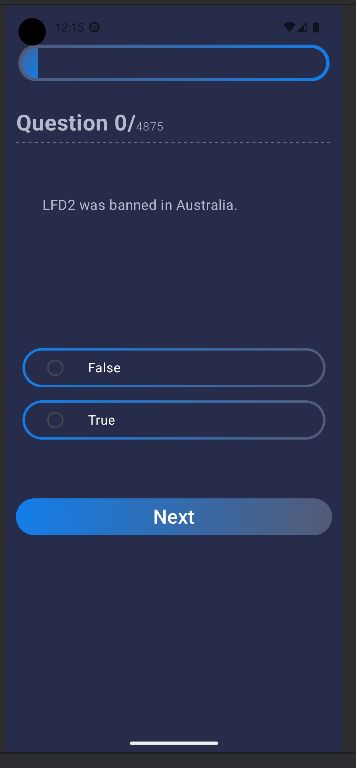
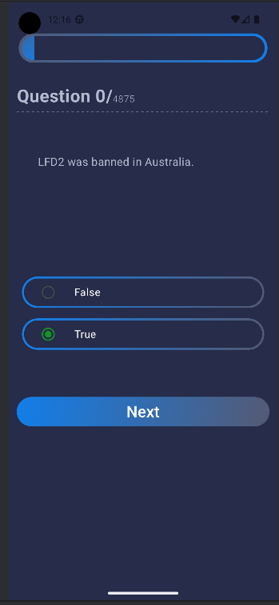
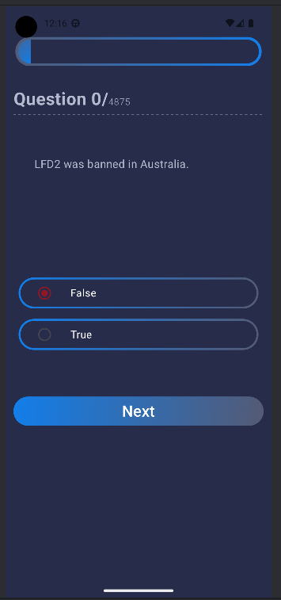
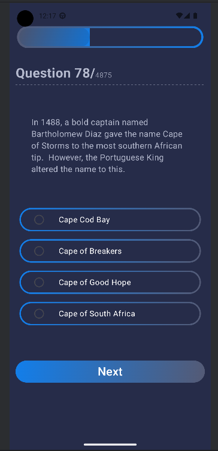

## Technologies Used

- **Jetpack Compose**: Utilized for building the user interface with a declarative approach, making it easier to create Android interfaces.
- **Kotlin**: The primary programming language for the app, chosen for its concise and expressive syntax, which enhances code readability and maintainability.
- **Retrofit**: Used for making HTTP requests to the Trivia JSON API, ensuring efficient and smooth data retrieval.
- **Coroutines**: Employed to manage background tasks, providing a responsive and smooth user interface by handling asynchronous operations.
- **ViewModel and LiveData**: Implemented for managing UI-related data in a lifecycle-conscious way, ensuring that the user interface stays updated with the latest data and survives configuration changes.

## Screenshots

  
  
  
  

